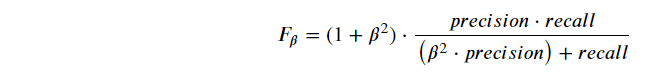
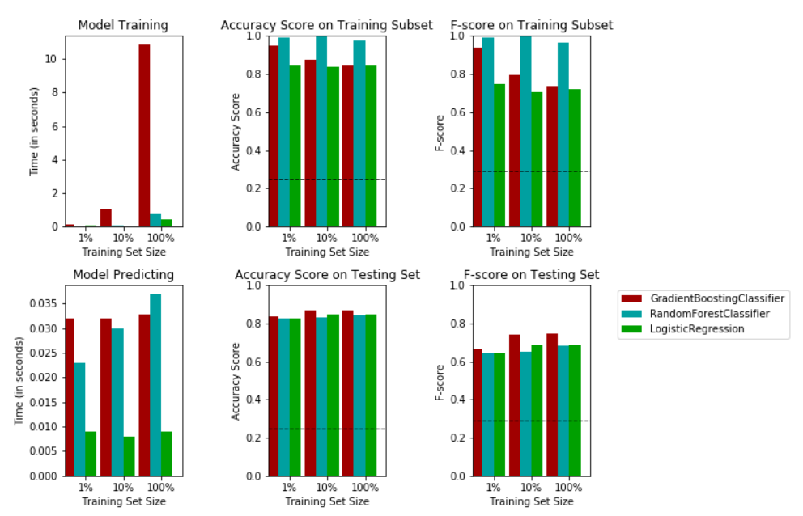
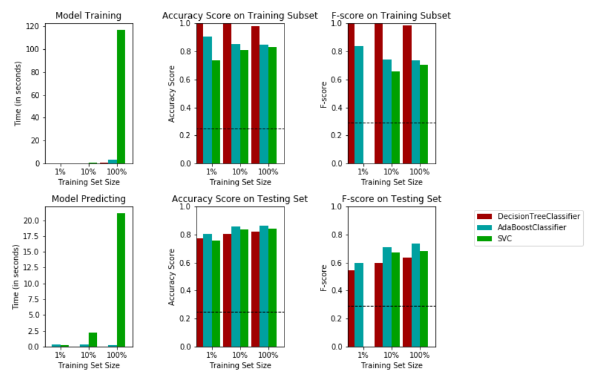

# Finding Donors for CharityML
Training 6 different **Supervised Machine Learning** in **scikit-learn** framework then tuning and optimizing of the best model to increase the **accuracy**. 

This project is part of Udacity Machine Learning Nanodegree projects.

# Table of Content

1. [Introduction](#introduction)
2. [Project Overview](#project-overview)
3. [Prerequisites](#prerequisites)
4. [Starting the Project](#starting-the-project)
    1. [Code](#code)
    2. [Run](#run)
    3. [Data](#data)
    4. [Results](#results)
    5. [Loading the Trained Model](#loading-the-trained-model)
5. [References](#references)
6. [Author](#author)
7. [License](#license)


## Introduction
In this project, I used 6 differnet **Supervised Machine Learning** models to train and test the [dataset](https://archive.ics.uci.edu/ml/datasets/Census+Income). I also used **F-beta score** as a metric that considers both precision and recall:



In particular, when  𝛽=0.5 , more emphasis is placed on precision. This is called the F(0.5)_score (or F-score for simplicity).

The tested models are:

| Model |
| ----- |
| 1. [Random Forest](https://en.wikipedia.org/wiki/Random_forest) |
| 2. [Gradient Boosting](https://en.wikipedia.org/wiki/Gradient_boosting) |
| 3. [Logistic Regression](https://en.wikipedia.org/wiki/Logistic_regression) |
| 4. [Decision Trees](https://en.wikipedia.org/wiki/Decision_tree) |
| 5. [AdaBoost](https://en.wikipedia.org/wiki/AdaBoost) |
| 6. [Support Vector Machine](https://en.wikipedia.org/wiki/Support-vector_machine) |

And then I visualized a graph to compare between: 
* Accuracy Score on Training & Testing Subsets.
* F-Score on Training & Testing Subsets.
* Time of Model Training & Testing.

| 1. Gradient Boosting Classifier | 2. Random Forest Classifier | 3. Logistic Regression |
| --- | --- | --- |


| 4. Decision Tree Classifier | 5. AdaBoost Classifier | 6. Support Vector Classifier |
| --- | --- | --- |



From graphs, it's obvious that AdaBoost Classifier is better in both Accuracy and F-Score. So after that, we'll use it with the [GridSearch](https://en.wikipedia.org/wiki/Hyperparameter_optimization#Grid_search) technique to **tune** our model and **optimize** its hyperparameter in order to increase the Accuracy and F-Score as it's shown [below](https://github.com/AhMeDxHaMiDo/Finding-Donors-for-CharityML#results)


## Project Overview
I applied supervised learning techniques and an analytical mind on data collected for the U.S. census to help CharityML (a fictitious charity organization) identify people most likely to donate to their cause. I started by exploring the data to learn how the census data is recorded. Next, I applied a series of transformations and preprocessing techniques to manipulate the data into a workable format. Then I evaluated several supervised models on the data, and considered which is best suited for the solution. Afterwards, I optimized the model you've selected and present it as your solution to CharityML. Finally, you will explore the chosen model and its predictions under the hood, to see just how well it's performing when considering the data it's given.


## Prerequisites

This project uses the following software and Python libraries:

- [Python](https://www.python.org/download/releases/3.0/)
- [NumPy](http://www.numpy.org/)
- [Pandas](http://pandas.pydata.org/)
- [scikit-learn](http://scikit-learn.org/stable/)
- [matplotlib](http://matplotlib.org/)

You will also need to have software installed to run and execute a Jupyter Notebook.

If you do not have Python installed yet, it is highly recommended that you install the Anaconda distribution of Python, which already has the above packages and more included.


## Starting the Project

This project contains three files:

- [`finding-donors-for-charityML.ipynb`](https://github.com/AhMeDxHaMiDo/Finding-Donors-for-CharityML/blob/master/finding-donors-for-charityML.ipynb): This is the main file where you will find all the work on the project.
- [`census.csv`](https://github.com/AhMeDxHaMiDo/Finding-Donors-for-CharityML/blob/master/census.csv): The project dataset. Which is loaded this data in the notebook.
- [`visuals.py`](https://github.com/AhMeDxHaMiDo/Finding-Donors-for-CharityML/blob/master/visuals.py): A Python file containing visualization code that is run behind-the-scenes. Do not modify

### Code

Template code is provided in the [`finding-donors-for-charityML.ipynb`](https://github.com/AhMeDxHaMiDo/Finding-Donors-for-CharityML/blob/master/finding-donors-for-charityML.ipynb) notebook file. The script [`visuals.py`](https://github.com/AhMeDxHaMiDo/Finding-Donors-for-CharityML/blob/master/visuals.py) Python file is also required for the visualizing functions, and the [`census.csv`](https://github.com/AhMeDxHaMiDo/Finding-Donors-for-CharityML/blob/master/census.csv) dataset file.

### Run

In a terminal or command window, navigate to the top-level project directory `Finding-Donors-for-CharityML/` (that contains this README) and run one of the following commands:

```
ipython notebook finding-donors-for-charityML.ipynb
```  
or
```
jupyter notebook finding-donors-for-charityML.ipynb
```

This will open the iPython Notebook software and project file in your browser.

### Data

The modified census dataset consists of approximately 32,000 data points, with each datapoint having 13 features. This dataset is a modified version of the dataset published in the paper *"Scaling Up the Accuracy of Naive-Bayes Classifiers: a Decision-Tree Hybrid",* by Ron Kohavi. You may find this paper [online](https://www.aaai.org/Papers/KDD/1996/KDD96-033.pdf), with the original dataset hosted on [UCI](https://archive.ics.uci.edu/ml/datasets/Census+Income).

* **Features**
    - `age`: Age
    - `workclass`: Working Class (Private, Self-emp-not-inc, Self-emp-inc, Federal-gov, Local-gov, State-gov, Without-pay, Never-worked)
    - `education_level`: Level of Education (Bachelors, Some-college, 11th, HS-grad, Prof-school, Assoc-acdm, Assoc-voc, 9th, 7th-8th, 12th, Masters, 1st-4th, 10th, Doctorate, 5th-6th, Preschool)
    - `education-num`: Number of educational years completed
    - `marital-status`: Marital status (Married-civ-spouse, Divorced, Never-married, Separated, Widowed, Married-spouse-absent, Married-AF-spouse)
    - `occupation`: Work Occupation (Tech-support, Craft-repair, Other-service, Sales, Exec-managerial, Prof-specialty, Handlers-cleaners, Machine-op-inspct, Adm-clerical, Farming-fishing, Transport-moving, Priv-house-serv, Protective-serv, Armed-Forces)
    - `relationship`: Relationship Status (Wife, Own-child, Husband, Not-in-family, Other-relative, Unmarried)
    - `race`: Race (White, Asian-Pac-Islander, Amer-Indian-Eskimo, Other, Black)
    - `sex`: Sex (Female, Male)
    - `capital-gain`: Monetary Capital Gains
    - `capital-loss`: Monetary Capital Losses
    - `hours-per-week`: Average Hours Per Week Worked
    - `native-country`: Native Country (United-States, Cambodia, England, Puerto-Rico, Canada, Germany, Outlying-US(Guam-USVI-etc), India, Japan, Greece, South, China, Cuba, Iran, Honduras, Philippines, Italy, Poland, Jamaica, Vietnam, Mexico, Portugal, Ireland, France, Dominican-Republic, Laos, Ecuador, Taiwan, Haiti, Columbia, Hungary, Guatemala, Nicaragua, Scotland, Thailand, Yugoslavia, El-Salvador, Trinadad&Tobago, Peru, Hong, Holand-Netherlands)

* **Target Variable**
    - `income`: Income Class (<=50K, >50K)

### Results:

|     Metric     | Naive Predictor | Unoptimized Model | Optimized Model |
| :------------: | :-------------: | :---------------: | :-------------: | 
| Accuracy Score | 0.2478 | 0.8638 | 0.8709 |
| F-score        | 0.2917 | 0.7333 | 0.7446 |

### Loading the Trained Model
* You could [download](https://github.com/AhMeDxHaMiDo/Finding-Donors-for-CharityML/blob/master/optimized_model.sav) the optimized model and load it by the following commands:
```
import pickle
filename = 'optimized_model.sav'
loaded_model = pickle.load(open(filename, 'rb'))
```

## References
* [Random Forest Simple Explanation](https://medium.com/@williamkoehrsen/random-forest-simple-explanation-377895a60d2d)
* [A Gentle Introduction to the Gradient Boosting Algorithm for Machine Learning | Machine Learning Mastery](https://machinelearningmastery.com/gentle-introduction-gradient-boosting-algorithm-machine-learning/)
* [Logistic Regression — Detailed Overview | Towards Data Science](https://towardsdatascience.com/logistic-regression-detailed-overview-46c4da4303bc)
* [Decision Trees in Machine Learning | Towards Data Science](https://towardsdatascience.com/decision-trees-in-machine-learning-641b9c4e8052)
* [Boosting and AdaBoost for Machine Learning | Machine Learning Mastery](https://machinelearningmastery.com/boosting-and-adaboost-for-machine-learning/)
* [Chapter 2 : SVM (Support Vector Machine) — Theory | Machine Learning 101](https://medium.com/machine-learning-101/chapter-2-svm-support-vector-machine-theory-f0812effc72)
* [Grid Searching in Machine Learning: Quick Explanation and Python Implementation](https://medium.com/@elutins/grid-searching-in-machine-learning-quick-explanation-and-python-implementation-550552200596)

## Author
* **Ahmed Hamido**
    * [LinkedIn](https://www.linkedin.com/in/ahmedxhamido/)

## License
[**MIT License**](https://choosealicense.com/licenses/mit/)

***Inspired by Udacity Machine Learning Engineer Nanodegree***.
